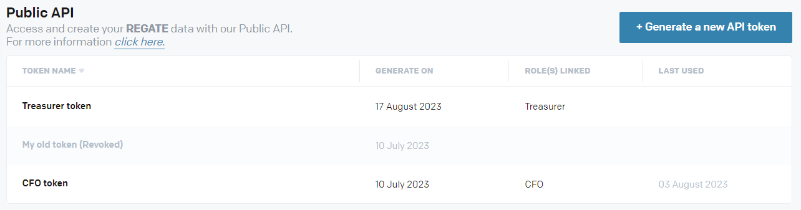

# Overview

The Regate API uses Bearer tokens to authenticate requests. The tokens are generated and managed in the Regate app under **Settings > Connect Regate to your tools > Public API**.

> 📘 Info
>
> Only Regate users with a CFO role are able to access this section of the Regate app and create / manage Bearer tokens.

# Create a token

When creating a token, the user selects the following attributes:

- Token name
- User role permissions

The bearer tokens do not have a validity period and do not expire. A user is able to create multiple tokens.

## Token visibility

Once created, **the token value will be visible only once.** For security purposes, the token value is not stored on Regate's end. Please make sure to copy its value before proceeding further.

## Token permissions

The user role permissions selected for the token regulate what type of API calls can be made using it. For example, permissions may allow users to only retrieve sales invoices, but not create new ones. In case an API request is authenticated with a token without permissions for that specific call, a `403 - Forbidden` error code will be returned.

Below you can see which API calls are accessible to a user, based on the role assigned to the token:

| Endpoints                                | CFO with Certified accountant | CFO              | Certified acc. Customer | Certified accountant | Certified acc. customer (no payment) | Treasurer | Manager (invoices) | Manager (expenses) | Chief accountant | Accountant (expenses) | Accountant (invoices) |
| ---------------------------------------- | ----------------------------- | ---------------- | ----------------------- | -------------------- | ------------------------------------ | --------- | ------------------ | ------------------ | ---------------- | --------------------- | --------------------- |
| /sales_invoices                          | POST, GET                     | POST, GET        | POST, GET               | POST, GET            | POST, GET                            | GET       | POST, GET          |                    | POST, GET        |                       | POST, GET             |
| /customers                               | POST, GET, PATCH              | POST, GET, PATCH | POST, GET, PATCH        | POST, GET, PATCH     | POST, GET, PATCH                     |           |                    |                    | GET              | GET                   | GET                   |
| /bank_accoutns                           | GET                           | GET              | GET                     | GET                  |                                      | GET       |                    |                    | GET              | GET                   | GET                   |
| /sales_vat_accoutns                      | GET                           | GET              | GET                     | GET                  | GET                                  | GET       | GET                | GET                | GET              | GET                   | GET                   |
| /products                                |                               | POST, GET        | POST, GET               |                      |                                      |           |                    |                    |                  |                       |                       |
| /users                                   | GET                           | POST, GET, PATCH | GET                     | GET                  | GET                                  | GET       | GET                | GET                | GET              | GET                   | GET                   |
| /user_roles                              | GET                           | GET              | GET                     | GET                  | GET                                  | GET       | GET                | GET                | GET              | GET                   | GET                   |
| /analytical_plans                        | GET                           | GET              | GET                     | GET                  | GET                                  |           | GET                | GET                | GET              | GET                   | GET                   |
| /analytical_plans/{plan_id}/cost_centers | GET                           | GET              | GET                     | GET                  | GET                                  |           | GET                | GET                | GET              | GET                   | GET                   |

# Manage your tokens

You can see the active tokens for your holding by going to **Settings > Connect Regate to your tools > Public API**. The following information is available:

- Token name
- Linked roles
- Token generation date
- Last used date

Tokens can also be revoked from this section.

> 🚧 Warning
>
> Once revoked, a token cannot be reinstated.